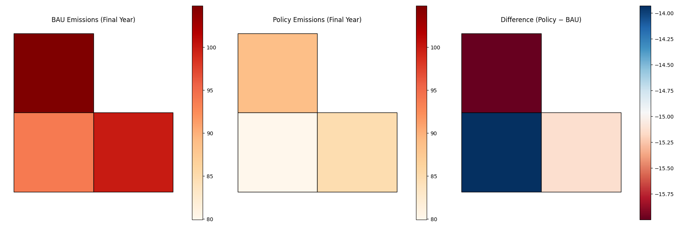
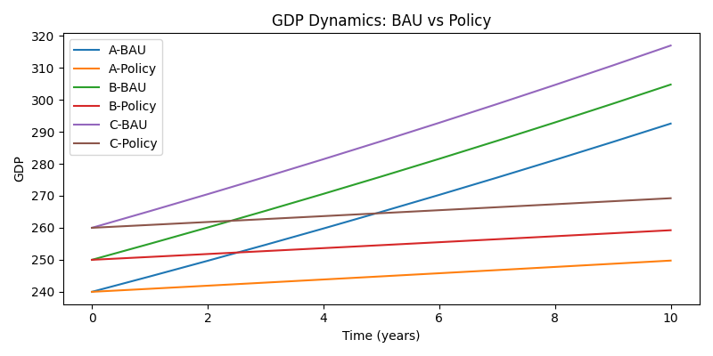
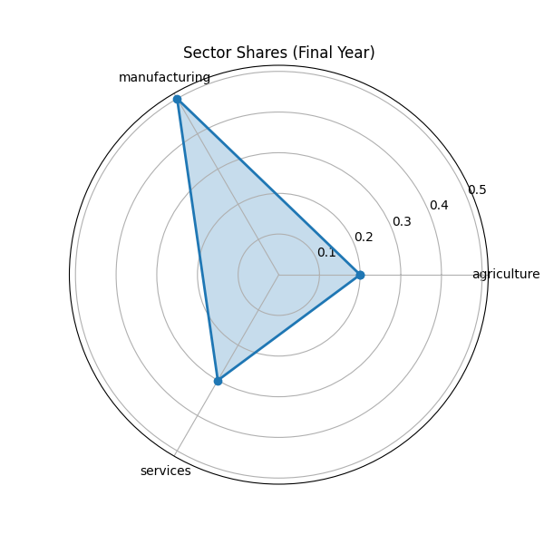

## Spatial Dynamic CGE Model

このリポジトリでは、3地域（A, B, C）×3部門（agriculture, manufacturing, services）の動学的応用一般均衡（CGE）モデルをPyomoで構築し、社会会計表（SAM）に基づくキャリブレーション、BAU／Policyシナリオの実行、可視化までを行う。

### ディレクトリ構成
```
cge-spatial-dynamic/
├─ data/                   入力データ（SAM, GeoJSON）
├─ models/                 モデル定義・キャリブレーション結果
│   ├─ parameters.py       モデルの基本パラメータ
│   ├─ cge_model.py        Pyomoモデル定義
│   └─ calibrated_params.json  キャリブレーション結果（α, X0）
├─ scripts/                各ステップ実行スクリプト
│   ├─ calibrate.py        SAMからαとX₀を算出・JSON保存
│   ├─ run_bau.py          BAUシナリオ実行 → results_bau.csv出力
│   └─ run_policy.py       Policyシナリオ実行 → results_policy.csv出力
├─ outputs/                シミュレーション結果のCSV・図表
└─ notebooks/              Jupyter Notebook 実行例
```

### 1. モデル概要
- **State Variables**: `X[r,s,t]` = 地域r・部門s の時点tにおける生産量
- **Parameters**:
  - `α[r][s]`: SAMキャリブレーションによる部門シェア
  - `X0[r][s]`: 初期期（t=0）の出力
  - `g`: 外生的生産性成長率（例: 2%/年）
  - `τ`: 炭素税率（BAU=0, Policy>0）
  - `ef[s]`: 部門別排出係数
- **Dynamics**:
  ```
  X[r,s,0] = X0[r][s]
  X[r,s,t] = (1+g)·α[r][s]·Σ_{p∈S} X[r,p,t-1]
             − τ·ef[s]·X[r,s,t-1]
  ```

### 2. キャリブレーション (`scripts/calibrate.py`)
1. `data/sam/sam_base.csv` を読み込み、支出項目合計から各(r,s)の出力を計算
2. `α[r][s]` = 出力／地域総出力、`X0[r][s]` = 当該出力
3. `models/calibrated_params.json` にネスト辞書形式で保存

### 3. シナリオ実行スクリプト
- **run_bau.py**:
  - JSON読み込み → `α, X0` を上書き
  - `τ=0` 設定、モデル実行、`results_bau.csv` 出力
- **run_policy.py**:
  - JSON読み込み → `α, X0` を上書き
  - `τ=0.05` 設定、モデル実行、`results_policy.csv` 出力

### 4. 可視化例
- **Choropleth Map**: BAU/Policy最終年排出量、同じスケールで比較
- **Difference Map**: Policy−BAUで削減量を可視化
- **Time Series Plot**: BAU vs Policy のGDP推移比較
- **Sankey, Radar**: 部門間フロー・部門シェア構造の可視化

### 5. Jupyter Notebook 実行方法
```bash
cd notebooks
jupyter notebook  # または lab
```
Notebook例では、以下のセル順で実行します:
1. SolverのPATH設定（Windows+GLPKの場合）
2. `%run ../scripts/calibrate.py`
3. `%run ../scripts/run_bau.py`
4. `%run ../scripts/run_policy.py`
5. 結果CSVを読み込み、`display(...)`で確認/可視化

---



